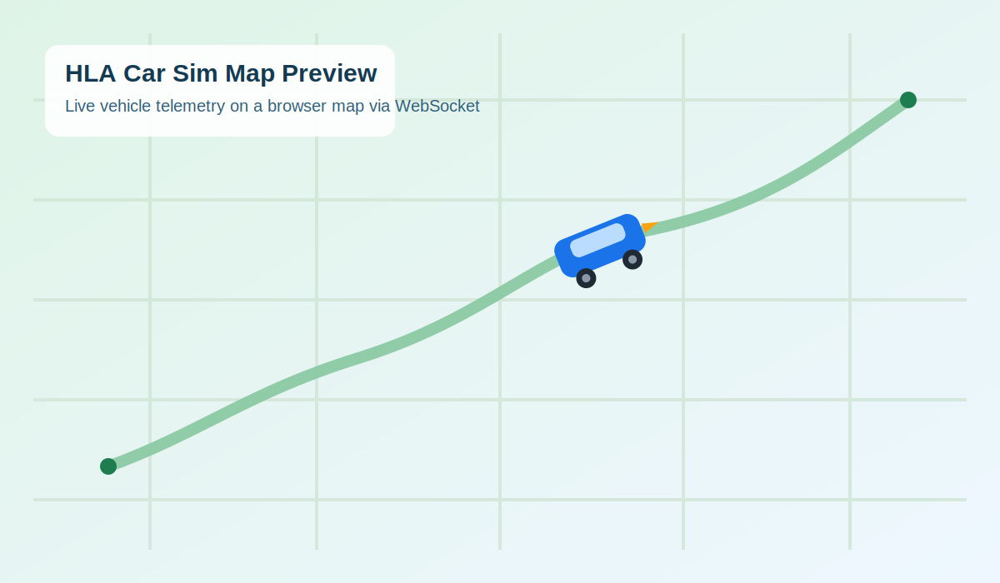

# HLA Car Sim 

A C++17 car simulation with real-time WebSocket telemetry. The simulation accepts keyboard commands to control a vehicle (start engine, accelerate, brake) and streams vehicle state (latitude, longitude, heading, speed) to a browser-based map client via WebSocket.

## Requirements

- CMake 3.10+
- A C++ compiler with C++17 support (clang++ or g++)
- [ixwebsocket](https://github.com/machinezone/IXWebSocket) (included in `external/`)

## Build

**First time / after changing CMakeLists.txt:**
```bash
./build.sh
```

**Incremental builds (day-to-day development):**
```bash
cmake --build build/
```

The executable is placed in `bin/`.

## Run

**1. Start the simulation:**
```bash
./bin/HLA_Personal_Project
```

**2. Open the map client** (in a separate terminal or directly from Finder):
```bash
open data/map.html
```

The WebSocket server starts automatically on `ws://127.0.0.1:8080`. The map will connect as soon as the sim is running.

## Commands

| Key | Action |
|-----|--------|
| `s` | Start engine |
| `o` | Stop engine |
| `w` | Accelerate (+10 mps) |
| `b` | Brake (stop immediately) |
| `d` | Display current speed |
| `v` | Display vehicle state + broadcast over WebSocket |
| `h` | Show commands |
| `q` | Quit |

## Map Client

`data/map.html` is a Leaflet.js map that connects to the WebSocket server. When the `v` command is used in the sim, the car's position is sent as JSON and the map updates in real time:

- The car is rendered as a **directional SVG icon** that rotates with the vehicle's heading
- The map pans to keep the car in view
- A popup shows current speed and heading

### Map Preview

Sample preview of the browser map and car marker:



The JSON payload format is:
```json
{ "lat": 53.3498, "lon": -6.2603, "heading": 0.0, "speed": 10.0 }
```

## Project Structure

```
HLA_Personal_Project/
├── CMakeLists.txt        # Build configuration
├── build.sh              # Full clean build script
├── include/              # Header files (Car.h)
├── src/                  # Source files (main.cpp, Car.cpp)
├── external/ixwebsocket/ # WebSocket library
├── bin/                  # Built executable
├── build/                # CMake-generated build files
├── data/                 # Map client (map.html)
├── doc/                  # Documentation
└── lib/                  # Libraries
```
